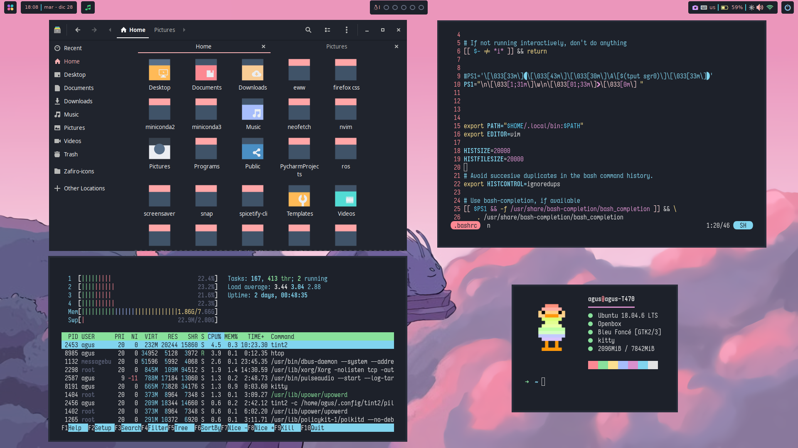
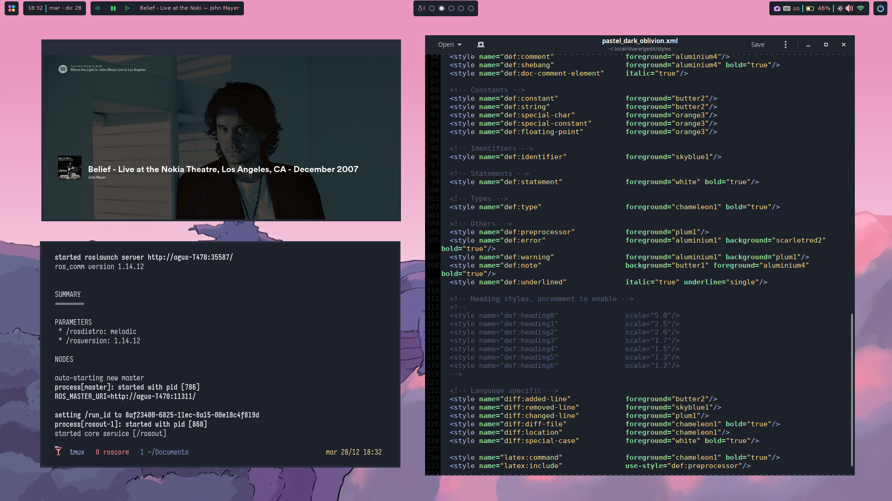

# Ubuntu Pastel Rice 

This rice is an Ubuntu adaptation and customization of [TheSuburbanExorcist](https://github.com/obliviousofcraps/mf-dots.git) repository.

*Caveat*: Work in progress :snail:

##   Configuration
- OS: Ubuntu 18.04 LTE
- WM: Openbox
- Terminal: Kitty
- Shell: ZSH
- Theme: Bleu Foncé
- Icons: Cherry
- Font icons: Icomoon and Fontello
- FM: Nautilus

##  Dependencies:
openbox, obconf, nitrogen, scrot, xclip, lxappereance, nautilus, rofi, kitty, zsh, dunst, tint2, redshift, tmux, [tpm](https://github.com/tmux-plugins/tpm), xbacklight ([link](https://askubuntu.com/questions/715306/xbacklight-no-outputs-have-backlight-property-no-sys-class-backlight-folder) for possible bug), dmenu, Imagemagick, gnome-screensaver, xset, xautolock, xfce4-power-manager, clipit, lxpolkit, [networkmanager-dmenu](https://github.com/firecat53/networkmanager-dmenu) (with repspective requirements; [link](https://stackoverflow.com/questions/59389831/cannot-import-name-gi) for possible bug), awk, perl, sed, [playerctl](https://github.com/altdesktop/playerctl) (useful [link](https://askubuntu.com/questions/1080671/how-can-i-install-playerctl)), gedit, gedit-plugins, spotify, neofetch (>=v7.1), zathura, [bat](https://github.com/sharkdp/bat)

scripts mast have executable permissions

##  Keep ricing 
### TODO:
- [x] Add brightness control
- [x] Configure redshift
- [x] Add Network Manager
- [x] Add Screen saver
- [x] Add tmux
- [x] Spotify basic control via panel 
- [x] Change Gedit theme
- [x] Change neofetch art
- [ ] Push vim configs
- [ ] Add multi-display capability
- [ ] Add bluetooth control
- [ ] Custom display manager
- [ ] Add code editor and ide themes (vscode, pycharm)
- [ ] Add useful widgets
- [ ] Spicetify spotify

### Backlog:
- xcompmgr for transparencies?

##  Known Bugs:
- Kitty only launches with bash ➔ ZSH is activated via .bashrc.

##  Credits:
- [u/TheSuburbanExorcist](https://github.com/obliviousofcraps/mf-dots)
- [Screensaver](https://buntu4win.wordpress.com/2015/05/04/how-to-build-a-kick-ass-screen-saverlock-for-openbox/)

 
 
 

