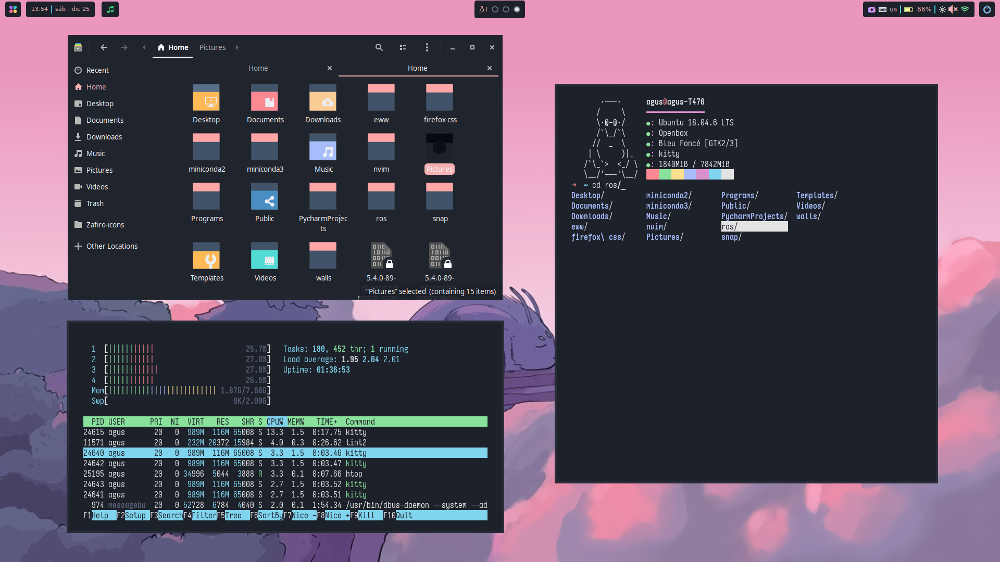

# Ubuntu Pastel Rice 

This rice is an Ubuntu adaptation and customization of [TheSuburbanExorcist](https://github.com/obliviousofcraps/mf-dots.git) repository.

##   Configuration
- OS: Ubuntu 18.04 LTE
- WM: Openbox
- Terminal: Kitty
- Shell: ZSH
- Theme: Bleu Foncé
- Icons: Cherry

##  Dependencies:
openbox, obconf, nitrogen, scrot, xclip, lxappereance, nautilus, rofi, kitty, zsh, dunst, tint2, redshift, tmux

##  Keep ricing 
### TODO:
- [ ]  Audio: Check .mpd and .ncmpcpp., cava
- [ ] Add tmux
- [ ] Add brightness control
- [ ] Add network control
- [ ] add code editor and ide themes (gedit, vscode, pycharm, etc, (vim for terminal (?))
- [ ] Add bluetooth control
- [ ] add useful widgets
- [ ] change neofetch ascii art
- [ ] configure redshift

### Backlog:
- xcompmgr for transparencies?

##  Credits:
- [u/TheSuburbanExorcist](https://github.com/obliviousofcraps/mf-dots)

