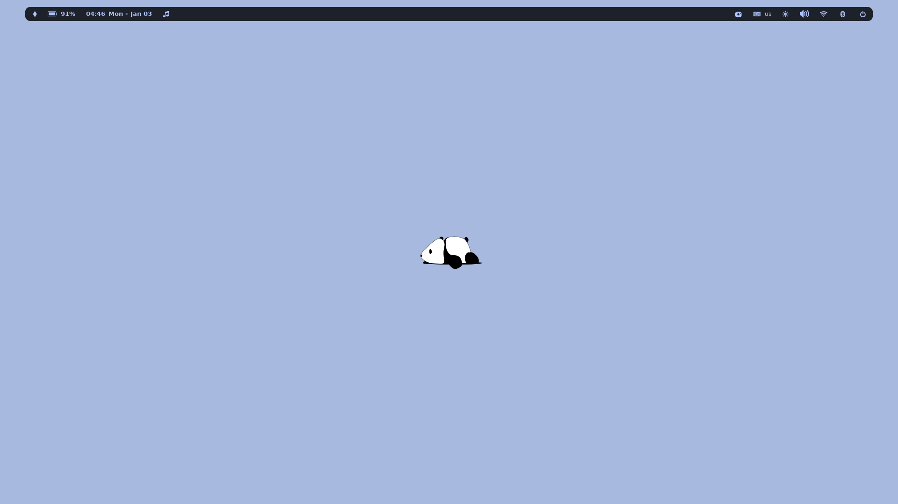
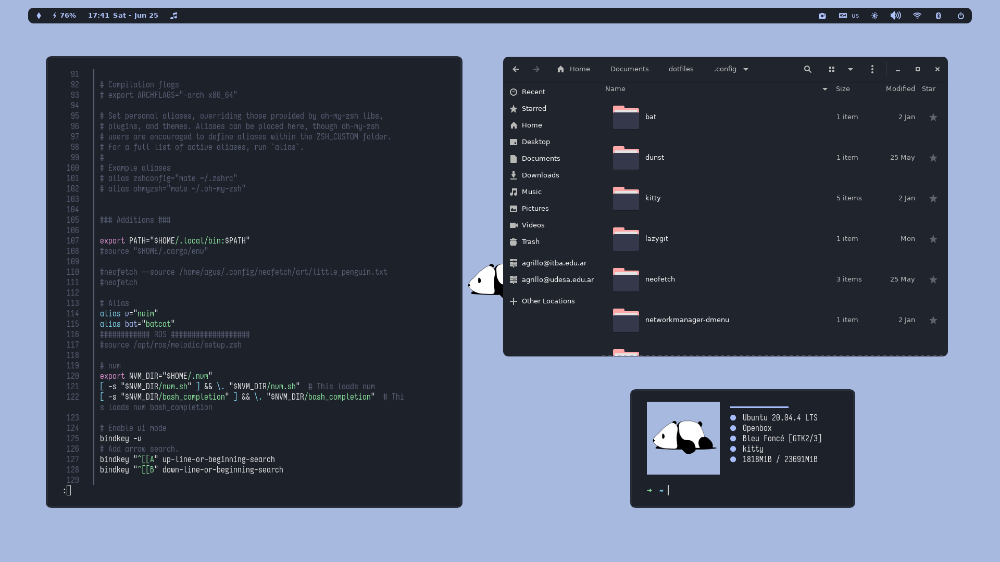
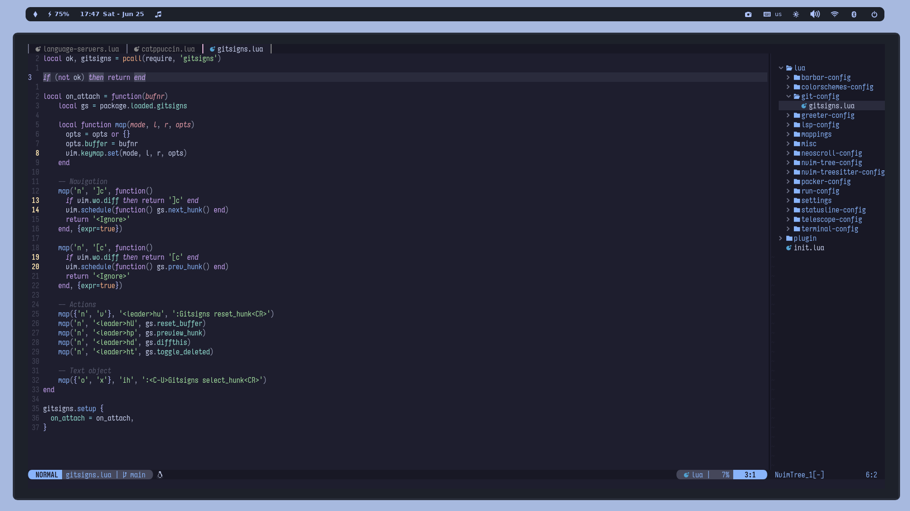
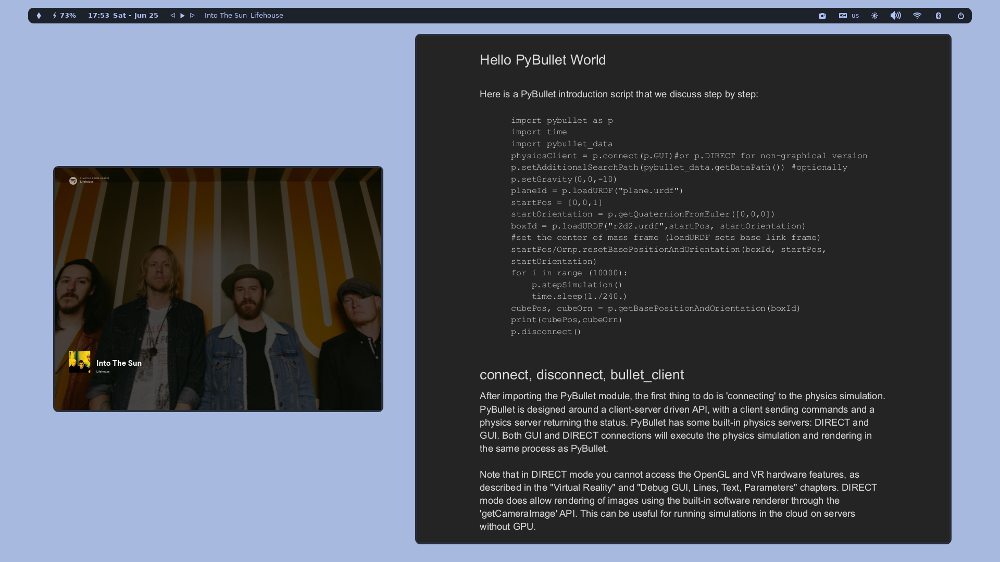

# Dotfiles

Linux and MacOS dotfiles.


## Configuration
- WM: I3 | Aerospace
- Terminal: Kitty
- Shell: ZSH








## Installation
```console
./<os>_install.sh
```

## Keep ricing 
### TODO
- [x] Add brightness control
- [x] Configure redshift
- [x] Add Network Manager
- [x] Add Screen saver
- [x] Add tmux
- [x] Spotify basic control via panel 
- [x] Change Gedit theme
- [x] Change neofetch art
- [x] Add bluetooth manager
- [x] Add rounded corners and shadows
- [x] Add multi-display capability (arandr)
- [x] Change screensaver (blued image) after suspend.
- [x] Change nautilus config, to launch specific terminal instead gnome-terminal.
- [x] Fix power prompt
- [x] Customize ROFI menu ([configs](https://github.com/adi1090x/rofi)). 
- [x] Customize vim and neovim configs
- [ ] Add shell script to automate installation.

### Backlog
- Custom display manager
- Change and rice terminal for better ssh compatibility.

## Known Bugs
- [x] Fan 100% after lockscreen ➔ High cpu usage by picom.

## Credits
- [u/TheSuburbanExorcist](https://github.com/obliviousofcraps/mf-dots)
- [Screensaver](https://buntu4win.wordpress.com/2015/05/04/how-to-build-a-kick-ass-screen-saverlock-for-openbox/)
